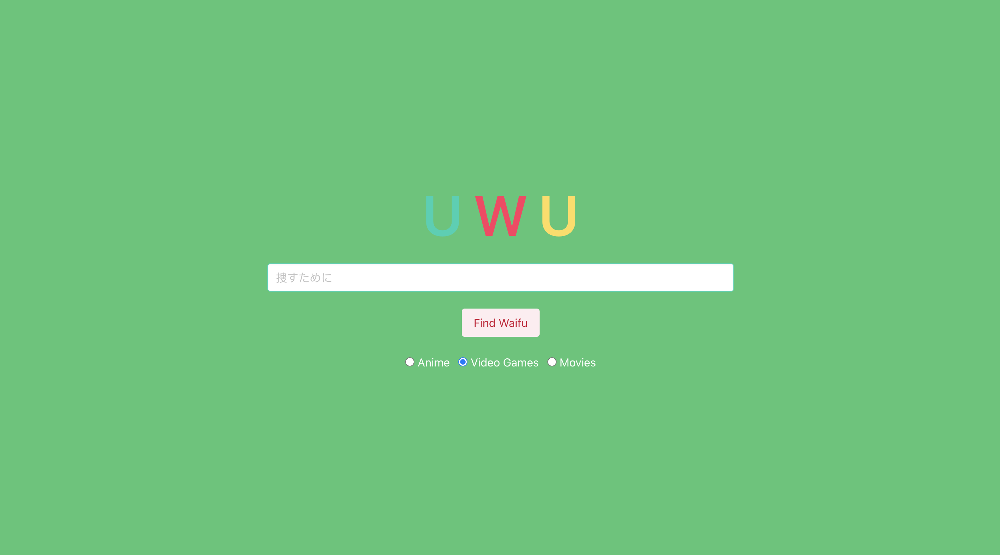

# uwu

## Table of Contents
    > Description
    > Prerequisites
    > Technologies
    > Installation
    > Screenshots
    > Contributors

### Description
This application was created to provide users with something everyone loves...OPTIONS.  At the click of a button they are able to access either anime, movie, or video game recommendations for the entity entered into the search field. Choices are displayed with the title, a thumbnail image, rating, and description.  This allows users to explore similar selections without putting the time and effort in to research.

### Prerequisites
It is a possibility that you may need to use CORS or Cross Origin Resource Sharing due to browsers being blocked by default when using JavaScript APIs.  Simply activate the add-on and perform the request - this will allow you to unblock this feature. Typically the icon is an orange letter C when activated.

### Technologies
- Javascript Framework
- JQuery
- CSS Framework
- Bulma (CSS Framework)
- Local Storage
- Jikan API to retrieve recommendations based on user input and retrieve information into the UI
- The MovieDb API to retrieve recommendations based on user input and retrieve information into the UI 
- RAWG video games API to retrieve recommendations based on user input and retrieve information into the UI 
- Deployment: Github pages
- Technical Overview:  On the landing page, the user input into the search field in addition to the user category selection of anime, movie, or video games will be used to make API calls for similar recommendations associated with that same category. Local storage will be utilized to set the user values from the landing page and get the values for the results page.  The recommendations are then displayed dynamitcally on the results page using Bulma components. 

### Installation
How to use: first you will land on the UWU's homepage - where you simply enter the entity you would like recommendations for then remember to select which genre you would like recommendations for - this will determine which category you results are filtered from.  Once the previously mentioned fields have been entered/selected you then click the Find Waifu button.  The Find Waifu button in-turn prompts the user to the results page.  Where the top 25 recommendations associated with your entity inputted on the landing page will be displayed on the results page according to the category selected.  Then the user will have the option to browse the top 25 recommendations.  The recommendation itself includes the title, a thumbnail image, rating, and description.  The back button is also available for the user to return back to the landing page from the results page.

### Screenshots

### Contributors
Jade Porter
Jonnah Marie Pangilinan
Van Taymany